# SyncTax

<p align="left">
  
</p>

SyncTax is an offline-first Android music player and recommender app that demonstrates privacy-preserving, on-device personalization and compact ML models. It combines a modern Android UI with background playback, local-first data storage, and a lightweight hybrid recommendation engine that uses Kotlin-based agents and an optional Python model via Chaquopy.

This README gives a quick project overview, usage tips, and developer setup instructions. For a deeper dive into architecture, models, and implementation details, see the Docs/ folder.

---

## Highlights

- Offline-first playback and recommendations
- Background audio with low battery impact
- Lightweight on-device personalization powered by Kotlin agents and a Python-based model (Chaquopy)
- Local media support (MP3/OGG/FLAC) alongside searchable YouTube frontends
- Clean Material 3 UI and modular architecture suitable for experimentation

---

## What's New in v3.0.0

- **Enhanced Search Performance**: Improved search speed for both local and online music discovery.
- **Download Feature**: Added download option for online songs directly from search results with Mutagen metadata embedding.
- **Lyrics Support**: New lyrics section with support for LRC files and online fetching from LRCLIB.
- **Quick Picks Management**: Long-press songs in Quick Picks to remove from listening history.
- **Optimized Permissions**: READ_MEDIA_IMAGES now optional for better privacy.
- **Performance Optimizations**: Database indices, chunked ML processing, 5-minute Quick Picks cache.
- **Smaller APK**: ~136 MB (ARM only, FFmpeg removed, x86 excluded).
- **UI Enhancements**: Various UI improvements for a better user experience.
- **Security Improvements**: Restricted directory scanning to only user-selected directories.

---

### App screenshots

Below are screenshots showcasing the app's UI and key features, from initial setup through personalized recommendations.

#### Getting Started

<div align="center">

| Welcome Screen | Home (Getting Started) | Select Directory |
|:---:|:---:|:---:|
| 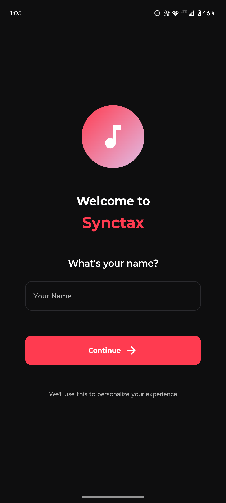 | 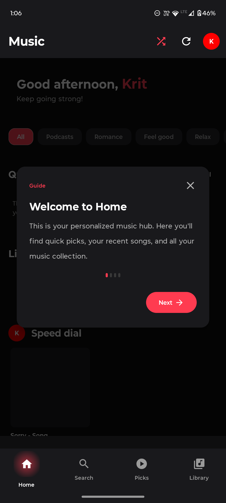 | 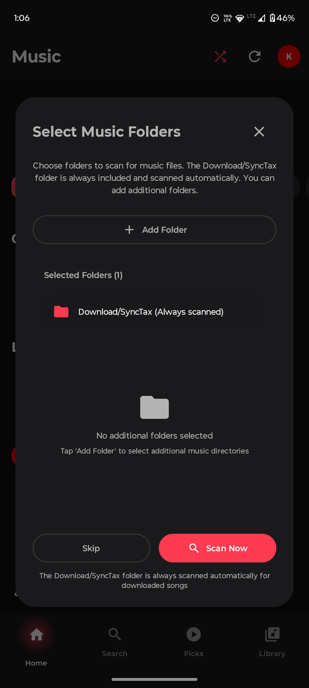 |
| App landing & onboarding | First-time home guidance | Directory selection (SAF)

</div>

#### Core Playback & Player

<div align="center">

| Offline Player | Offline Lyrics | Online Player |
|:---:|:---:|:---:|
| 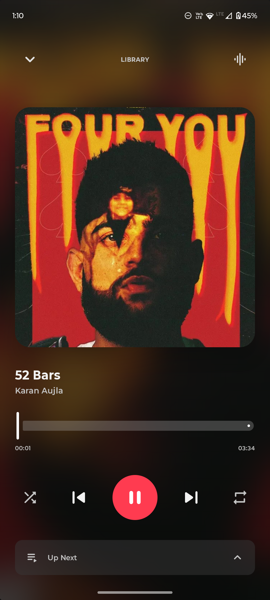 | 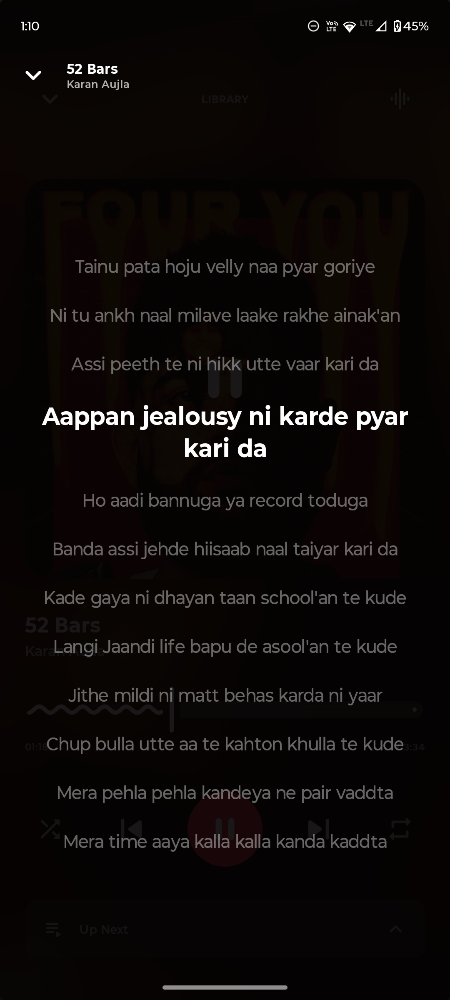 | 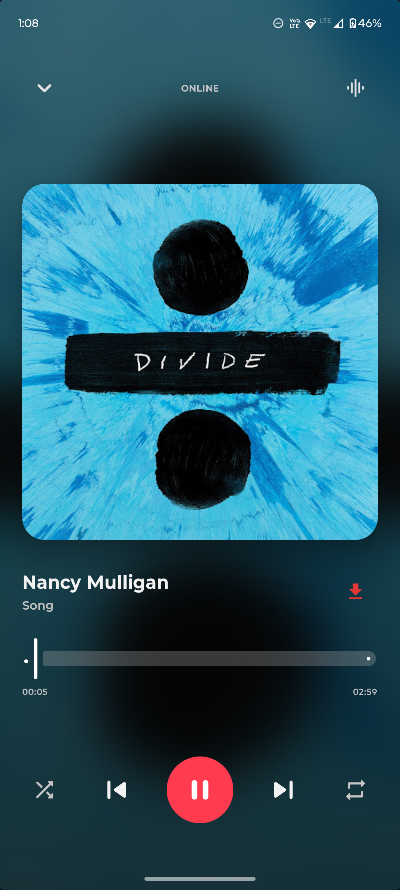 |
| Now playing (local) | Synchronized LRC display for local files | Online stream player

</div>

#### Online Player — Lyrics Flow

<div align="center">

| Lyrics Overlay | Lyrics Fetching | Lyrics Fetched |
|:---:|:---:|:---:|
| 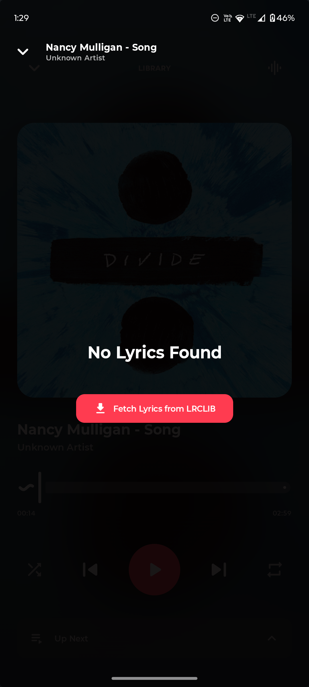 | 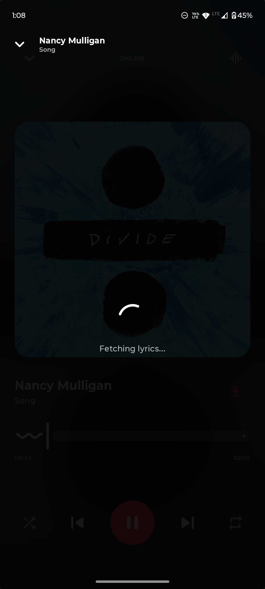 | 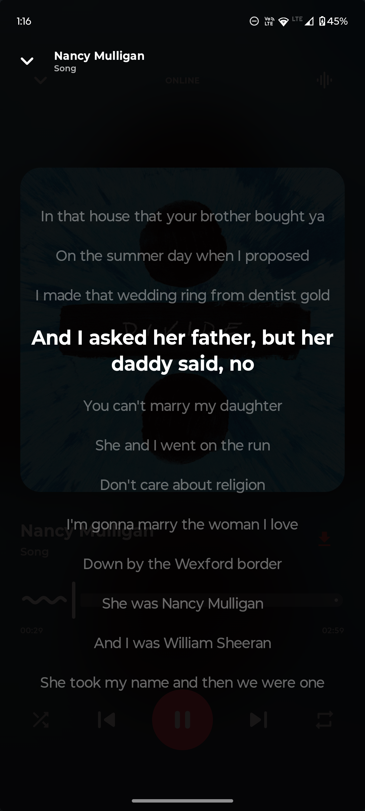 |
| Live overlay while streaming | LRCLIB / online lookup in progress | Online lyrics displayed

</div>

#### Library & Search

<div align="center">

| Library (Songs) | Library (Artists) | Albums |
|:---:|:---:|:---:|
| 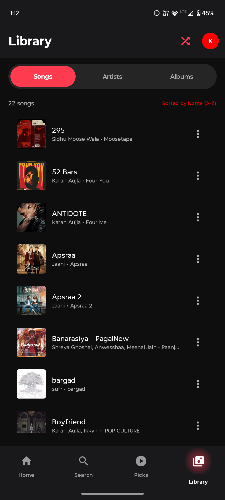 | 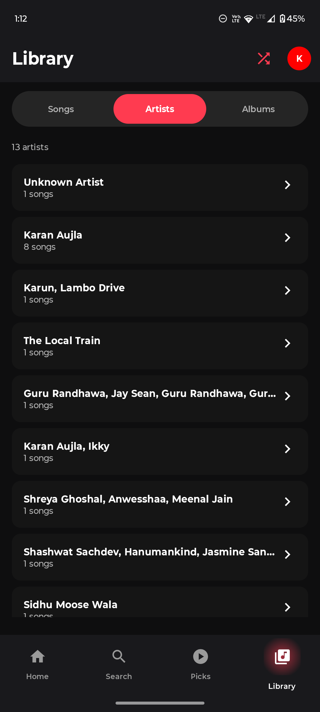 | 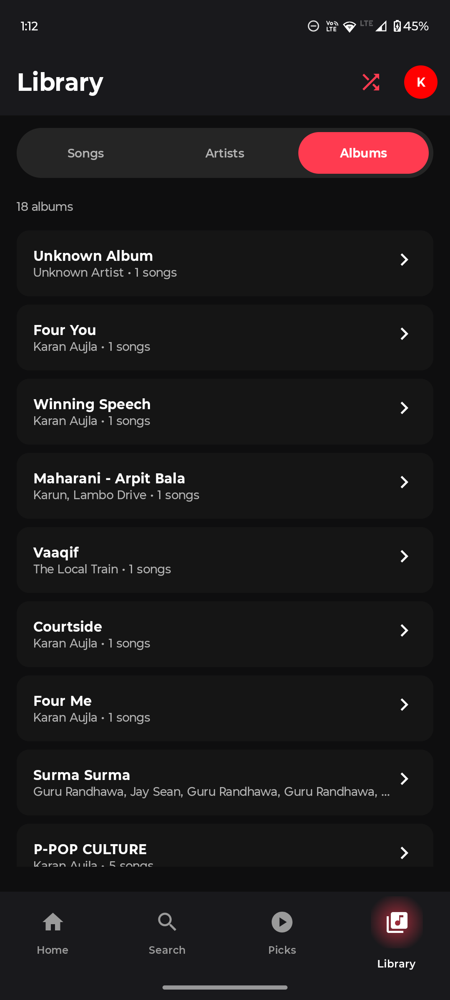 |
| Browse songs and play offline | Artist list & quick actions | Album view and track list

</div>

#### Search & Online Discovery

<div align="center">

| Local Search | Online Search Results |
|:---:|:---:|
|  | 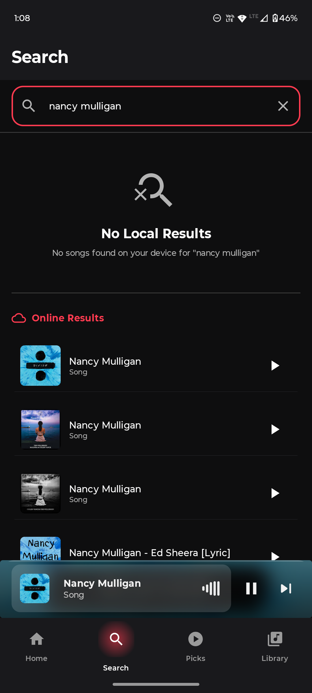 |
| Search local songs, albums, artists | Search results from online frontends |

</div>

#### Recommendations & Training

<div align="center">

| Quick Picks (Before) | Quick Picks (After) | Training Screen |
|:---:|:---:|:---:|
| 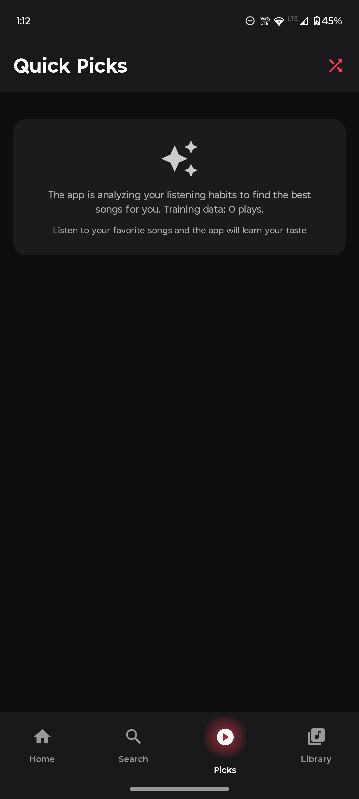 | 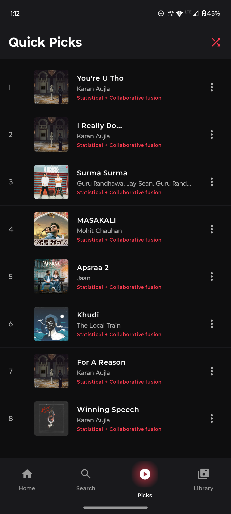 | 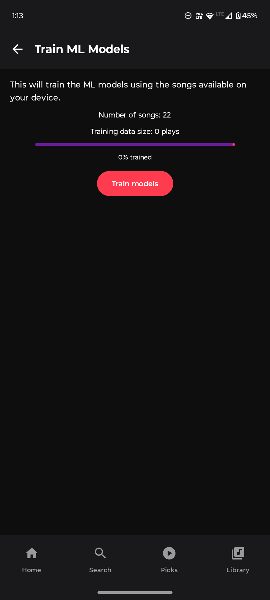 |
| Initial suggestions during learning | Personalized picks after training | Model training / status

</div>

#### Collections, Albums & Settings

<div align="center">

| Artist Detail | Album Detail | Settings |
|:---:|:---:|:---:|
| 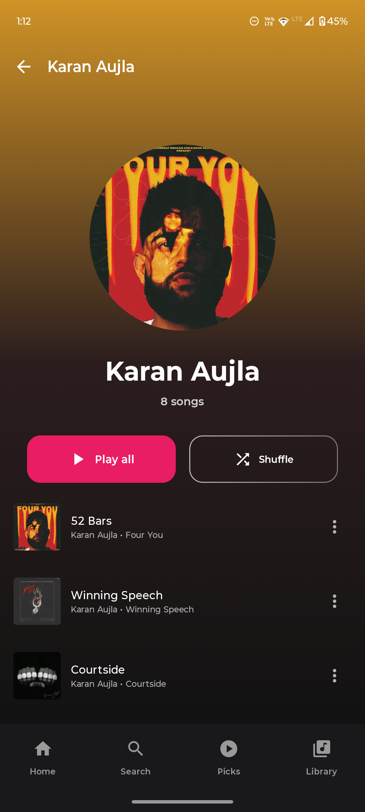 | 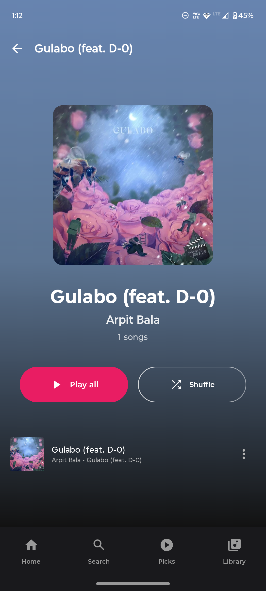 | 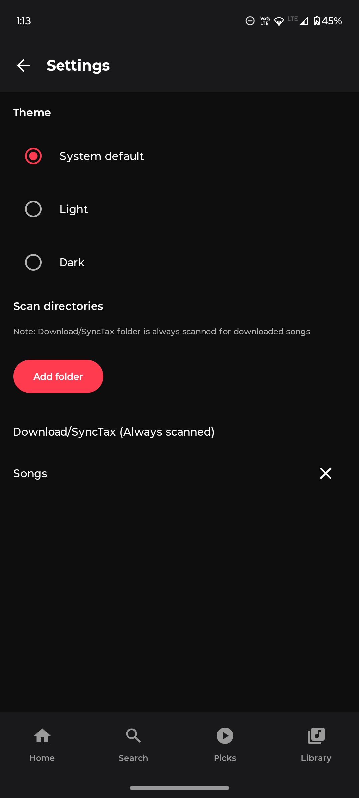 |
| Artist details & tracks | Album track listing & artwork | App settings & directory selection

</div>

[View full image gallery](./assets/screenshots/)

---

## Quick start (development)

1. Clone the repository

```
git clone https://github.com/krit-vardhan-mishra/SyncTax.git
cd SyncTax
```

2. Build and run (command line)

Windows (PowerShell):

```
./gradlew.bat assembleDebug
./gradlew.bat installDebug
```

Or open the project in Android Studio and run the `app` module on an emulator or device.

3. Optional: Provide a YouTube API key for fallback search results

If you want to use the YouTube Data API for search fallback, set `YOUTUBE_API_KEY` in your environment before launching the app. The app defaults to public frontends (Piped/Invidious) but uses the official API if configured.

On Windows PowerShell:

```
$env:YOUTUBE_API_KEY = "YOUR_YOUTUBE_API_KEY"
```

---

## Developer notes and project structure

- `app/` — Android module with UI, background playback, and Kotlin-based agents
- `Docs/` — Architecture, algorithms, and developer guides
- `scripts/` — Helper scripts for testing and data collection

If you're exploring the recommendation engine, start in `app/src/main/java` where Kotlin `agents` and `controllers` are arranged.

---

## Contributing

We welcome contributions! Good first issues, feature requests, translations, and bug reports help this project improve. Please see the `Docs/` for guidance on the repository layout and recommended tasks.

When contributing:

- Open issues for bugs or feature requests
- Submit PRs against the `master` branch with clear testing instructions
- Add or update docs when you add features

---

## Attribution & license

SyncTax is open source — see the repository license for details. This project is an independent app and is not affiliated with YouTube, Google LLC, or any of their subsidiaries.

---

## Help & Support

If you run into issues, please open an issue in the repository with steps to reproduce, logs, and device configuration.

For architecture and models, consult `Docs/` — it contains additional diagrams and how-tos to extend the Python model.

---

Thanks for checking out SyncTax — contributions and feedback are welcome!