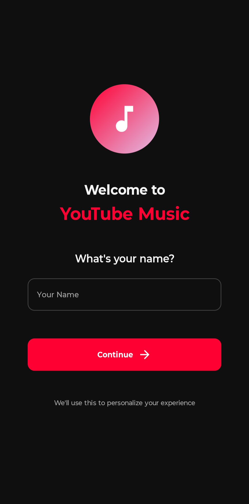
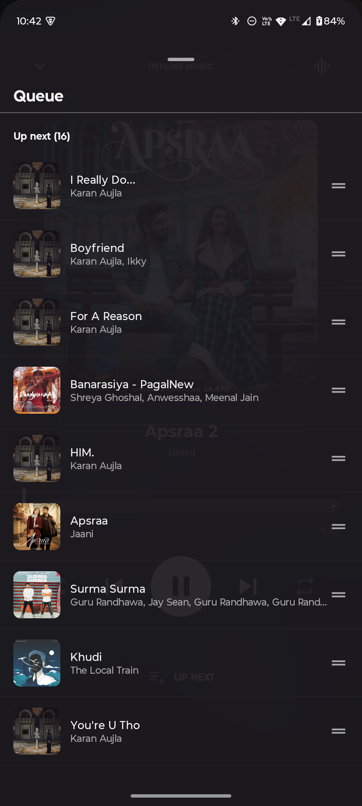
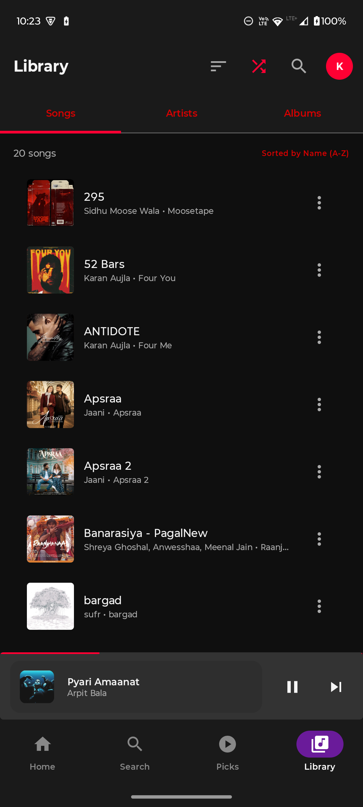
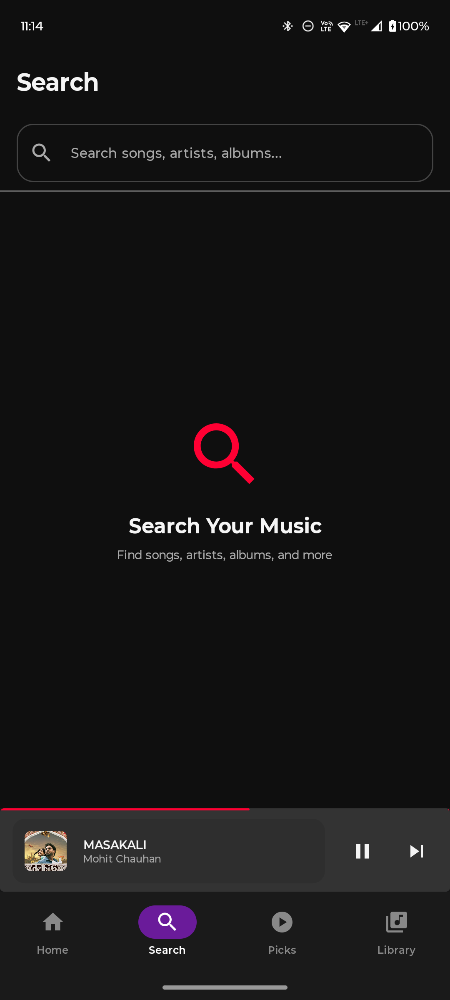
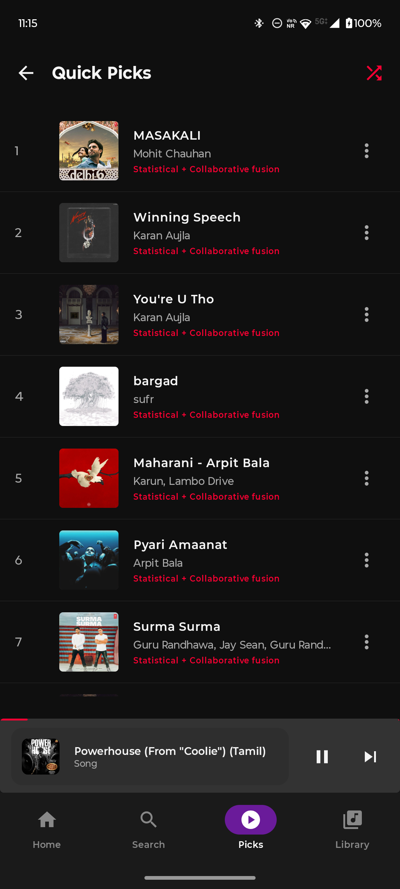
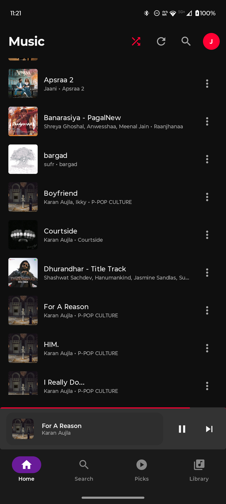

# SyncTax


SyncTax is an offline-first Android music player and recommender app that demonstrates privacy-preserving, on-device personalization and compact ML models. It combines a modern Android UI with background playback, local-first data storage, and a lightweight hybrid recommendation engine that uses Kotlin-based agents and an optional Python model via Chaquopy.

This README gives a quick project overview, usage tips, and developer setup instructions. For a deeper dive into architecture, models, and implementation details, see the `Docs/` folder.

---

## Highlights

- Offline-first playback and recommendations
- Background audio with low battery impact
- Lightweight on-device personalization powered by Kotlin agents and a Python-based model (Chaquopy)
- Local media support (MP3/OGG/FLAC) alongside searchable YouTube frontends
- Clean Material 3 UI and modular architecture suitable for experimentation

---

### App screenshots

Below are screenshots showcasing the app's UI and key features, from initial setup through personalized recommendations.

#### Getting Started

<div align="center">

| Welcome Screen | Home (Before Training) |
|:---:|:---:|
|  |  |
| Set up your profile | Home screen before the AI learns your taste |

</div>

#### Core Playback Experience

<div align="center">

| Music Player | Queue Management (Half) | Queue Management (Full) 
|:---:|:---:|:---:|
|  |  |  
| Full-featured player with offline support | View and manage your play queue | Queue fully opened |

</div>

#### Library & Search

<div align="center">

| Your Library | Local Search | Online Search Results |
|:---:|:---:|:---:|
|  |  |  |
| Browse your local collection | Search songs, artists, and albums | Find new music via YouTube frontends |

</div>

#### AI-Powered Recommendations

<div align="center">

| Quick Picks (Learning) | Quick Picks (Trained) | Home (After Training) |
|:---:|:---:|:---:|
|  |  |  |
| App analyzing your preferences | AI-curated picks based on listening habits | Personalized home with mood categories |

</div>

#### Enhanced Home Experience

<div align="center">

| Speed Dial & Collections | All Songs View |
|:---:|:---:|
|  |  |
| Quick access to favorite artists and playlists | Browse your complete music collection |

</div>

[View full image gallery](./assets/screenshots/)

---

## Quick start (development)

1. Clone the repository

```
git clone https://github.com/krit-vardhan-mishra/SyncTax.git
cd SyncTax
```

2. Build and run (command line)

Windows (PowerShell):

```
./gradlew.bat assembleDebug
./gradlew.bat installDebug
```

Or open the project in Android Studio and run the `app` module on an emulator or device.

3. Optional: Provide a YouTube API key for fallback search results

If you want to use the YouTube Data API for search fallback, set `YOUTUBE_API_KEY` in your environment before launching the app. The app defaults to public frontends (Piped/Invidious) but uses the official API if configured.

On Windows PowerShell:

```
$env:YOUTUBE_API_KEY = "YOUR_YOUTUBE_API_KEY"
```

---

## Developer notes and project structure

- `app/` — Android module with UI, background playback, and Kotlin-based agents
- `Docs/` — Architecture, algorithms, and developer guides
- `scripts/` — Helper scripts for testing and data collection

If you're exploring the recommendation engine, start in `app/src/main/java` where Kotlin `agents` and `controllers` are arranged.

---

## Contributing

We welcome contributions! Good first issues, feature requests, translations, and bug reports help this project improve. Please see the `Docs/` for guidance on the repository layout and recommended tasks.

When contributing:

- Open issues for bugs or feature requests
- Submit PRs against the `master` branch with clear testing instructions
- Add or update docs when you add features

---

## Attribution & license

SyncTax is open source — see the repository license for details. This project is an independent app and is not affiliated with YouTube, Google LLC, or any of their subsidiaries.

---

## Help & Support

If you run into issues, please open an issue in the repository with steps to reproduce, logs, and device configuration.

For architecture and models, consult `Docs/` — it contains additional diagrams and how-tos to extend the Python model.

---

Thanks for checking out SyncTax — contributions and feedback are welcome!