

  

# SyncTax - Offline-First AI Music Player for Android

**Privacy-first music player with on-device personalization and smart recommendations.**

Built with modern Jetpack Compose, it plays local music, streams from YouTube, downloads songs, shows synchronized lyrics, and learns your taste completely offline using lightweight ML models.

→ **136 MB APK** | **Android 10+** | **Material 3 Design**
---

## Highlights

- Offline-first playback and recommendations
- Background audio with low battery impact
- Lightweight on-device personalization powered by Kotlin agents and a Python-based model (Chaquopy)
- Local media support (MP3/OGG/FLAC) alongside searchable YouTube frontends
- Clean Material 3 UI and modular architecture suitable for experimentation

---

### App screenshots

Below are screenshots showcasing the app's UI and key features, from initial setup through personalized recommendations.

#### Getting Started

| Welcome Screen | Home (Getting Started) | Select Directory |
|:---:|:---:|:---:|
| 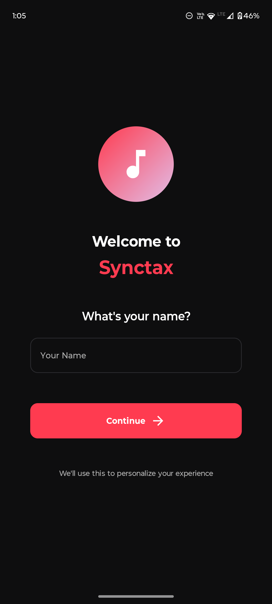 | 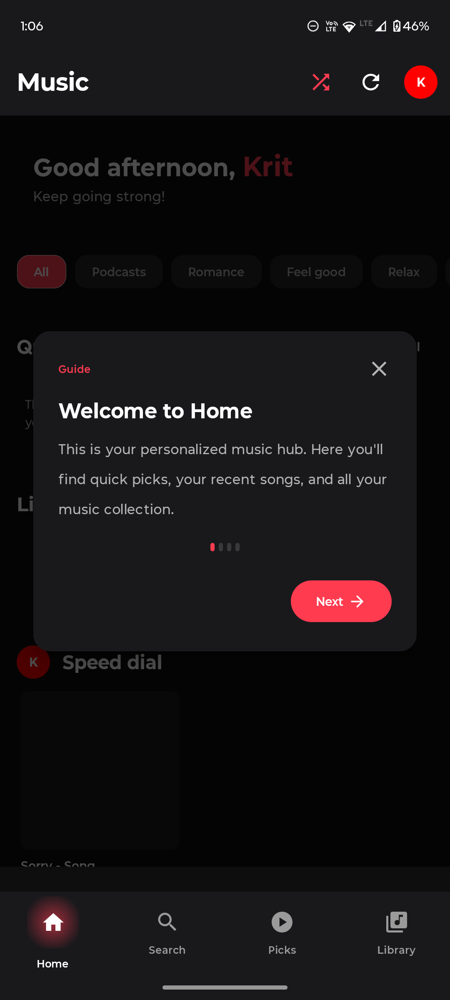 | 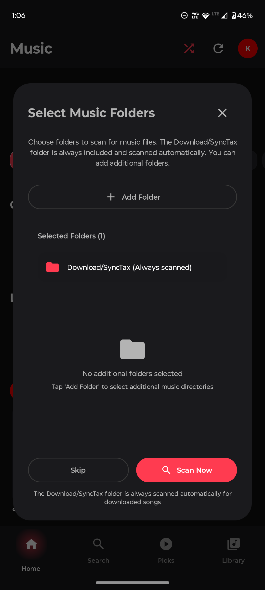 |
| App landing & onboarding | First-time home guidance | Directory selection (SAF)

#### Core Playback & Player

| Offline Player | Offline Lyrics | Online Player |
|:---:|:---:|:---:|
| 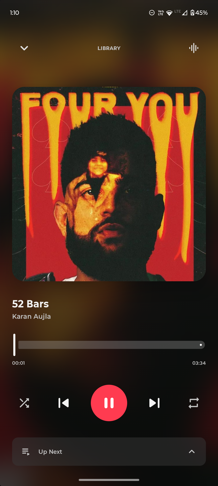 | 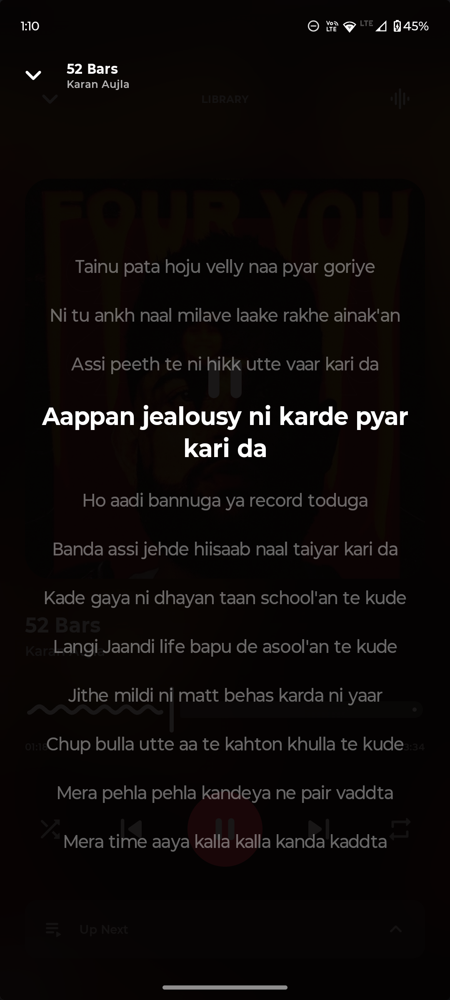 | 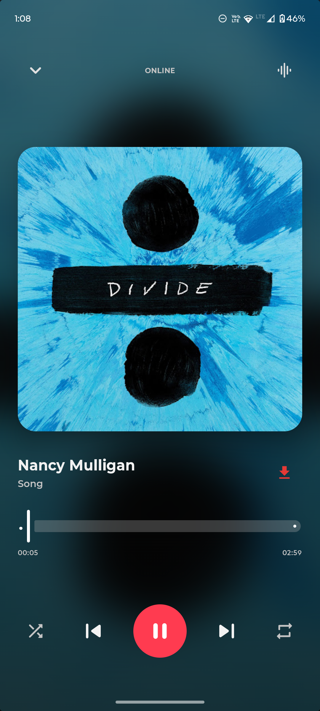 |
| Now playing (local) | Synchronized LRC display for local files | Online stream player

#### Online Player — Lyrics Flow

| Lyrics Overlay | Lyrics Fetching | Lyrics Fetched |
|:---:|:---:|:---:|
| 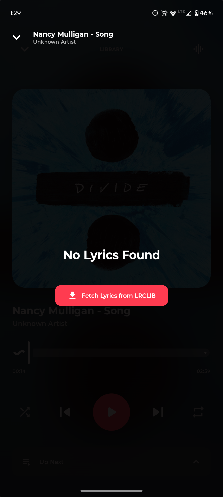 | 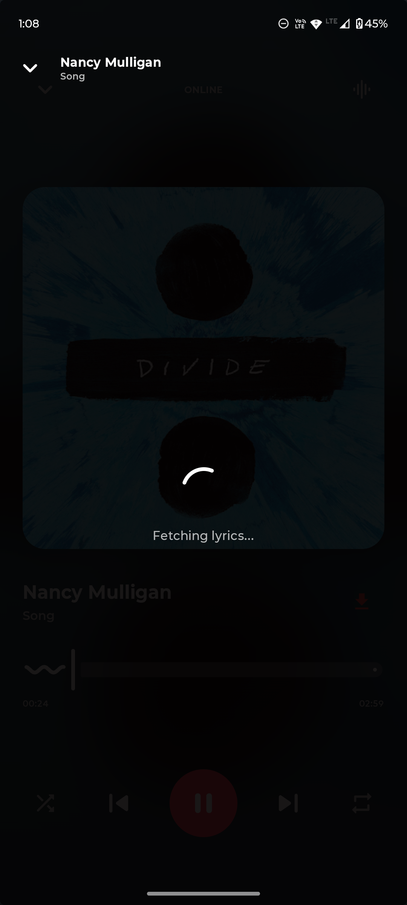 | 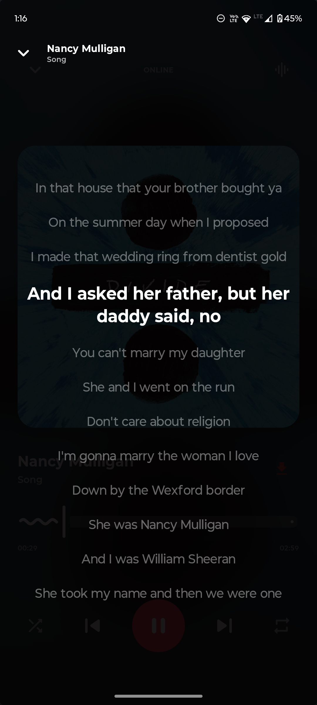 |
| Live overlay while streaming | LRCLIB / online lookup in progress | Online lyrics displayed

#### Library & Search

| Library (Songs) | Library (Artists) | Albums |
|:---:|:---:|:---:|
| 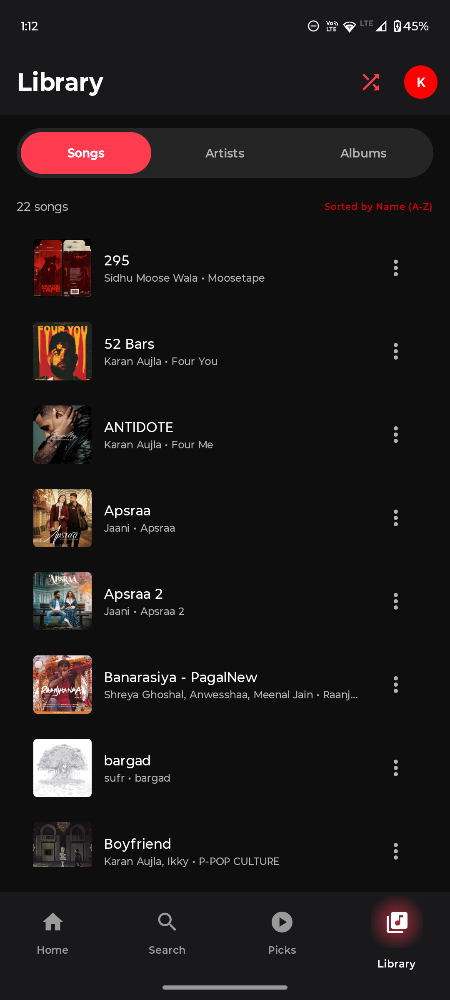 | 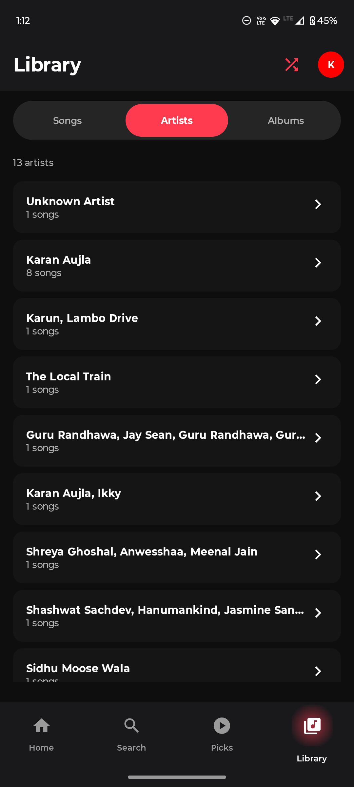 | 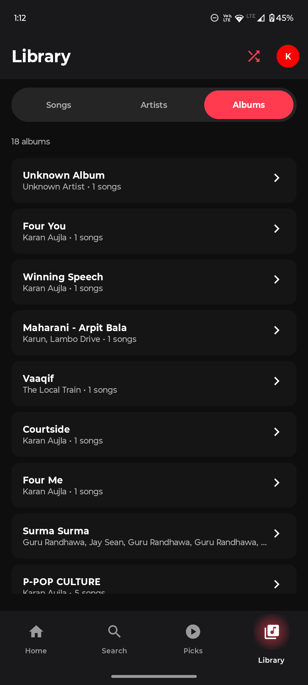 |
| Browse songs and play offline | Artist list & quick actions | Album view and track list

#### Search & Online Discovery

| Local Search | Online Search Results |
|:---:|:---:|
| 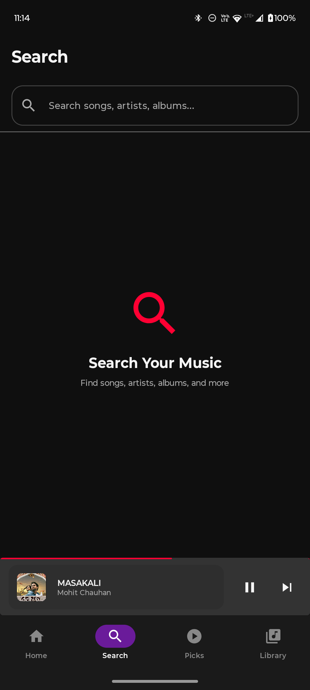 | 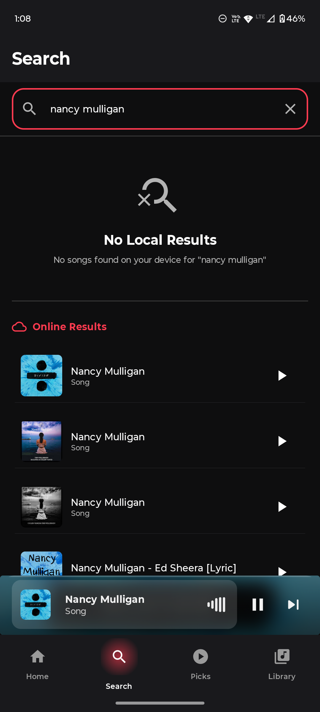 |
| Search local songs, albums, artists | Search results from online frontends |

#### Recommendations & Training

| Quick Picks (Before) | Quick Picks (After) | Training Screen |
|:---:|:---:|:---:|
| 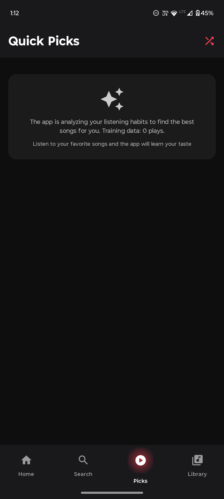 | 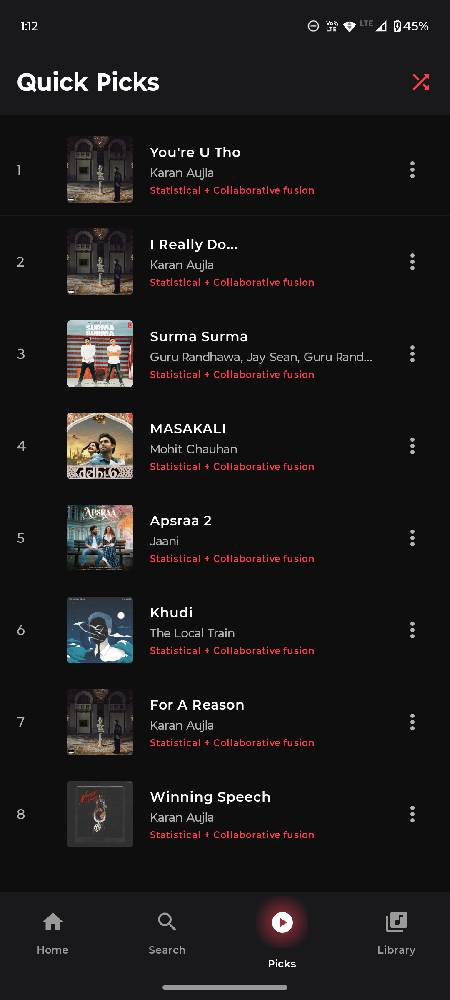 | 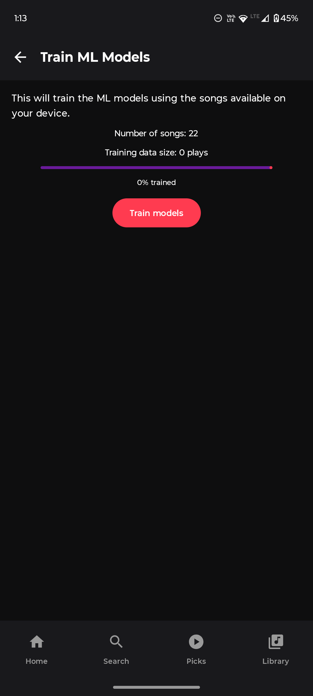 |
| Initial suggestions during learning | Personalized picks after training | Model training / status

#### Collections, Albums & Settings

| Artist Detail | Album Detail | Settings |
|:---:|:---:|:---:|
| 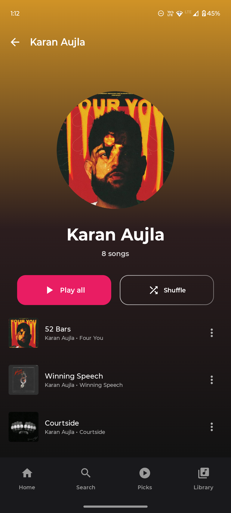 | 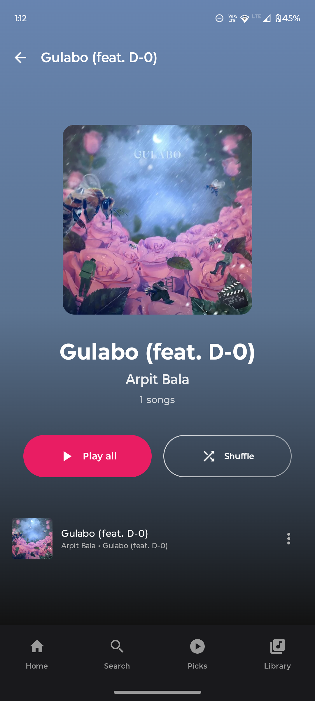 | 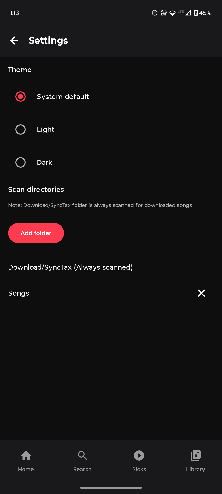 |
| Artist details & tracks | Album track listing & artwork | App settings & directory selection

[View full image gallery](./assets/screenshots/)

---

## Developer notes and project structure

- `app/` — Android module with UI, background playback, and Kotlin-based agents
- `Docs/` — Architecture, algorithms, and developer guides
- `scripts/` — Helper scripts for testing and data collection

---
Thanks for checking out SyncTax — contributions and feedback are welcome!
